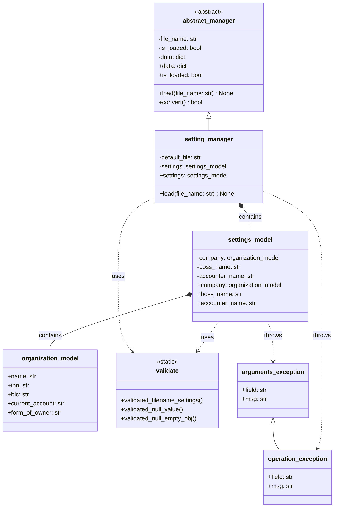

```mermaid
classDiagram
    class abstract_manager {
        <<abstract>>
        -file_name: str
        -is_loaded: bool
        -data: dict
        +load(file_name: str) None
        +convert() bool
        +data: dict
        +is_loaded: bool
    }

    class setting_manager {
        -default_file: str
        -settings: settings_model
        +load(file_name: str) None
        +settings: settings_model
    }

    class settings_model {
        -company: organization_model
        -boss_name: str
        -accounter_name: str
        +company: organization_model
        +boss_name: str
        +accounter_name: str
    }

    class organization_model {
        +name: str
        +inn: str
        +bic: str
        +current_account: str
        +form_of_owner: str
    }

    class validate {
        <<static>>
        +validated_filename_settings()
        +validated_null_value()
        +validated_null_empty_obj()
    }

    class arguments_exception {
        +field: str
        +msg: str
    }

    class operation_exception {
        +field: str
        +msg: str
    }

    abstract_manager <|-- setting_manager
    arguments_exception <|-- operation_exception

    setting_manager *-- settings_model : contains
    settings_model *-- organization_model : contains

    setting_manager ..> validate : uses
    setting_manager ..> operation_exception : throws
    settings_model ..> validate : uses
    settings_model ..> arguments_exception : throws
```