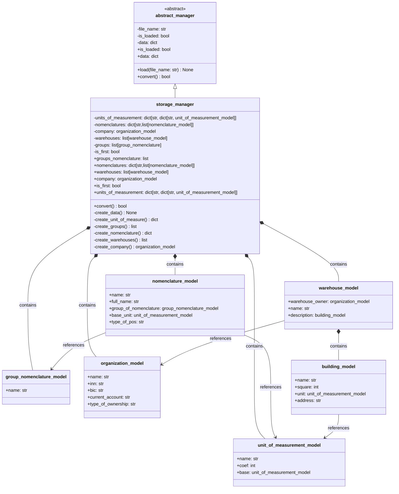

```mermaid
classDiagram
    class abstract_manager {
        <<abstract>>
        -file_name: str
        -is_loaded: bool
        -data: dict
        +load(file_name: str) None
        +convert() bool
        +is_loaded: bool
        +data: dict
    }

    class storage_manager {
        -units_of_measurement: dict[str, dict[str, unit_of_measurement_model]]
        -nomenclatures: dict[str,list[nomenclature_model]]
        -company: organization_model
        -warehouses: list[warehouse_model]
        -groups: list[group_nomenclature]
        -is_first: bool
        +convert() bool
        -create_data() None
        -create_unit_of_measure() dict
        -create_groups() list
        -create_nomenclature() dict
        -create_warehouses() list
        -create_company() organization_model
        +groups_nomenclature: list
        +nomenclatures: dict[str,list[nomenclature_model]]
        +warehouses: list[warehouse_model]
        +company: organization_model
        +is_first: bool
        +units_of_measurement: dict[str, dict[str, unit_of_measurement_model]]
    }

    class unit_of_measurement_model {
        +name: str
        +coef: int
        +base: unit_of_measurement_model
    }

    class nomenclature_model {
        +name: str
        +full_name: str
        +group_of_nomenclature: group_nomenclature_model
        +base_unit: unit_of_measurement_model
        +type_of_pos: str
    }

    class group_nomenclature_model {
        +name: str
    }

    class organization_model {
        +name: str
        +inn: str
        +bic: str
        +current_account: str
        +type_of_ownership: str
    }

    class warehouse_model {
        +warehouse_owner: organization_model
        +name: str
        +description: building_model
    }

    class building_model {
        +name: str
        +square: int
        +unit: unit_of_measurement_model
        +address: str
    }

    abstract_manager <|-- storage_manager

    storage_manager *-- unit_of_measurement_model : contains
    storage_manager *-- nomenclature_model : contains
    storage_manager *-- organization_model : contains
    storage_manager *-- warehouse_model : contains
    storage_manager *-- group_nomenclature_model : contains

    nomenclature_model --> group_nomenclature_model : references
    nomenclature_model --> unit_of_measurement_model : references
    warehouse_model *-- building_model : contains
    warehouse_model --> organization_model : references
    building_model --> unit_of_measurement_model : references
```