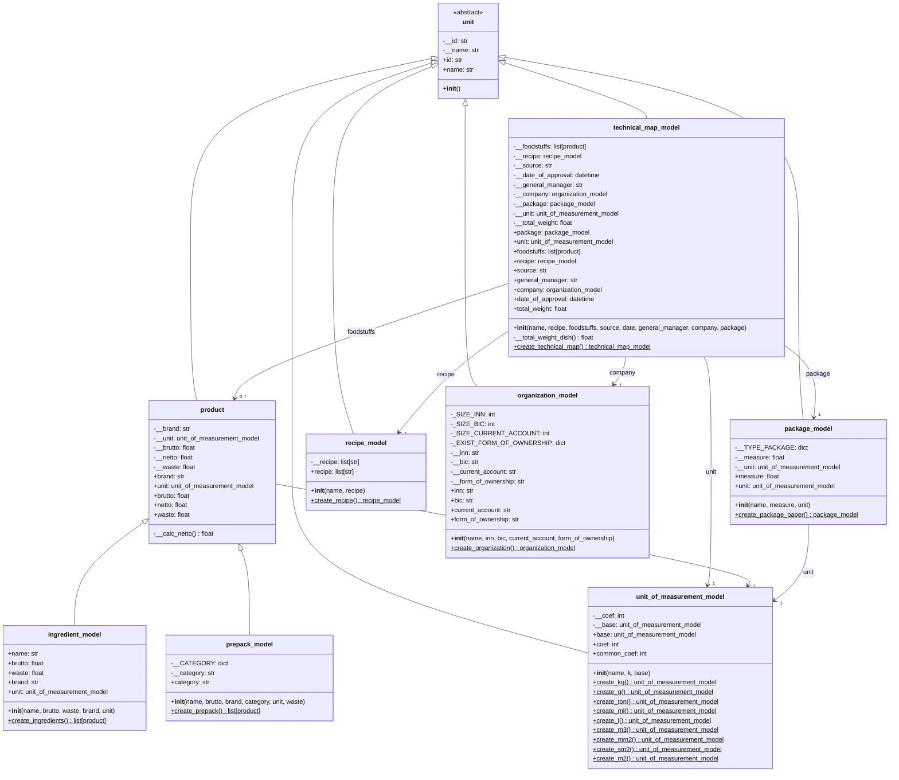

```mermaid
classDiagram
    class unit {
        <<abstract>>
        -__id: str
        -__name: str
        +id: str
        +name: str
        +__init__()
    }

    class product {
        -__brand: str
        -__unit: unit_of_measurement_model
        -__brutto: float
        -__netto: float
        -__waste: float
        +brand: str
        +unit: unit_of_measurement_model
        +brutto: float
        +netto: float
        +waste: float
        -__calc_netto() float
    }

    class ingredient_model {
        +name: str
        +brutto: float
        +waste: float
        +brand: str
        +unit: unit_of_measurement_model
        +__init__(name, brutto, waste, brand, unit)
        +create_ingredients()$ list[product]
    }

    class prepack_model {
        -__CATEGORY: dict
        -__category: str
        +category: str
        +__init__(name, brutto, brand, category, unit, waste)
        +create_prepack()$ list[product]
    }

    class package_model {
        -__TYPE_PACKAGE: dict
        -__measure: float
        -__unit: unit_of_measurement_model
        +measure: float
        +unit: unit_of_measurement_model
        +__init__(name, measure, unit)
        +create_package_paper()$ package_model
    }

    class technical_map_model {
        -__foodstuffs: list[product]
        -__recipe: recipe_model
        -__source: str
        -__date_of_approval: datetime
        -__general_manager: str
        -__company: organization_model
        -__package: package_model
        -__unit: unit_of_measurement_model
        -__total_weight: float
        +package: package_model
        +unit: unit_of_measurement_model
        +foodstuffs: list[product]
        +recipe: recipe_model
        +source: str
        +general_manager: str
        +company: organization_model
        +date_of_approval: datetime
        +total_weight: float
        +__init__(name, recipe, foodstuffs, source, date, general_manager, company, package)
        -__total_weight_dish() float
        +create_technical_map()$ technical_map_model
    }

    class unit_of_measurement_model {
        -__coef: int
        -__base: unit_of_measurement_model
        +base: unit_of_measurement_model
        +coef: int
        +common_coef: int
        +__init__(name, k, base)
        +create_kg()$ unit_of_measurement_model
        +create_g()$ unit_of_measurement_model
        +create_ton()$ unit_of_measurement_model
        +create_ml()$ unit_of_measurement_model
        +create_l()$ unit_of_measurement_model
        +create_m3()$ unit_of_measurement_model
        +create_mm2()$ unit_of_measurement_model
        +create_sm2()$ unit_of_measurement_model
        +create_m2()$ unit_of_measurement_model
    }

    class recipe_model {
        -__recipe: list[str]
        +recipe: list[str]
        +__init__(name, recipe)
        +create_recipe()$ recipe_model
    }

    class organization_model {
        -_SIZE_INN: int
        -_SIZE_BIC: int
        -_SIZE_CURRENT_ACCOUNT: int
        -_EXIST_FORM_OF_OWNERSHIP: dict
        -__inn: str
        -__bic: str
        -__current_account: str
        -__form_of_ownership: str
        +inn: str
        +bic: str
        +current_account: str
        +form_of_ownership: str
        +__init__(name, inn, bic, current_account, form_of_ownership)
        +create_organization()$ organization_model
    }

    unit <|-- product
    unit <|-- package_model
    unit <|-- technical_map_model
    unit <|-- unit_of_measurement_model
    unit <|-- recipe_model
    unit <|-- organization_model

    product <|-- ingredient_model
    product <|-- prepack_model

    technical_map_model --> "0..*" product : foodstuffs
    technical_map_model --> "1" recipe_model : recipe
    technical_map_model --> "1" organization_model : company
    technical_map_model --> "1" package_model : package
    technical_map_model --> "1" unit_of_measurement_model : unit

    product --> "1" unit_of_measurement_model : unit
    package_model --> "1" unit_of_measurement_model : unit
```